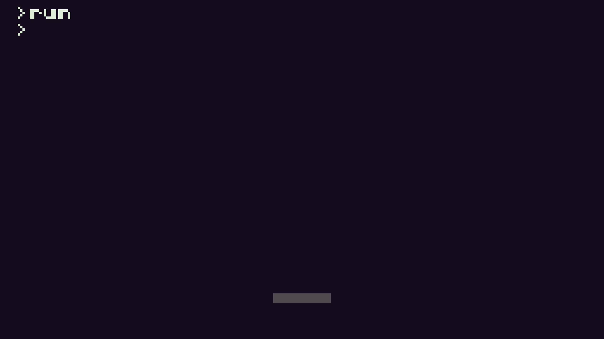

# Simple Breakout clone

In this short tutorial we are going to create a simple breakout clone.
We will start with the following basic structure:

```lua
-- title:  game title
-- author: game developer
-- desc:   short description
-- script: lua

function init()
 -- here we initialize all our variables and game objects
end

init()

function TIC()
 -- here we will place our main game loop
 input()
 update()
 draw()
end

function input()
 -- so that the player can actually do something
end

function update()
 -- so that something is going on
end

function draw()
 -- so we can see something
end
```

This structure is general, and you can use it for every game. Be aware, that you have to call the init() function before the TIC() function.

## Our player
So let's start with the player. We first do the initialisation and decide that we need a player position (x,y) obviously, a size definition of how big our player will be (width, height), the color and the speed definition (only x, because the player can only move to left and right and the max speed).

> The x position is (240/2)-12, so that it is exactly centered

```lua
function init()
 -- our player
 player = {
  x = (240/2)-12,
  y = 120,
  width = 24,
  height = 4,
  color = 3,
  speed = {
   x = 0,
   max = 4
  }
 }
end

init()

function TIC()
 input()
 update()
 draw()
end
```

Now we finally want to see something on the screen, so let's skip the input() and update() functions for now and go directly to the draw() function. We will split it into two functions: One for the game objects and one for the GUI.

```lua
function draw()
 drawGameObjects()
 drawGUI()
end

function drawGameObjects()
end

function drawGUI()
end
```

Drawing the player is as simple as this:

```lua
function drawGameObjects()
 -- draw player
 rect(player.x,
  player.y,
  player.width,
  player.height,
  player.color)
end
```

If you run the game now you will see the following:



Well, we see the player BUT we also see the console commands. We need to
clear the screen! So let's do it in the TIC() function:

```lua
function init()
 -- variables
 bgColor = 0

 -- our player
 ...
end

function TIC()
 cls(bgColor)
 input()
 update()
 draw()
end
```

I have defined a variable in the init() function and access it in the cls()
function. So now it should look like this:


Great!
