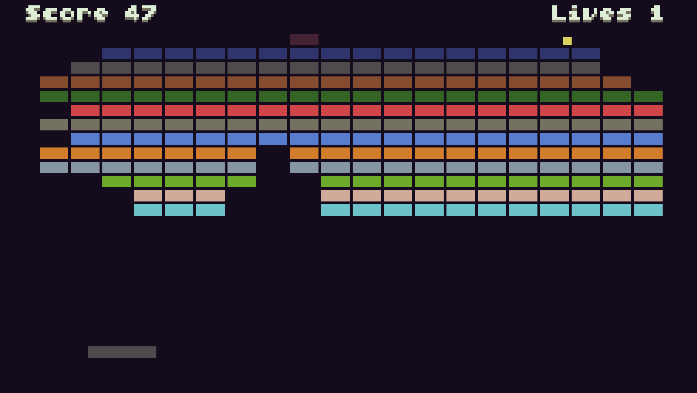
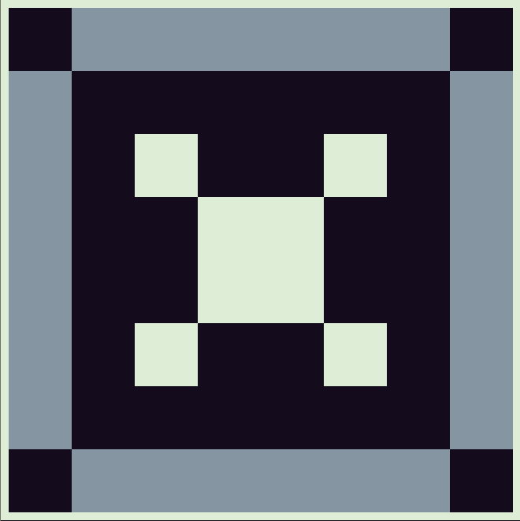
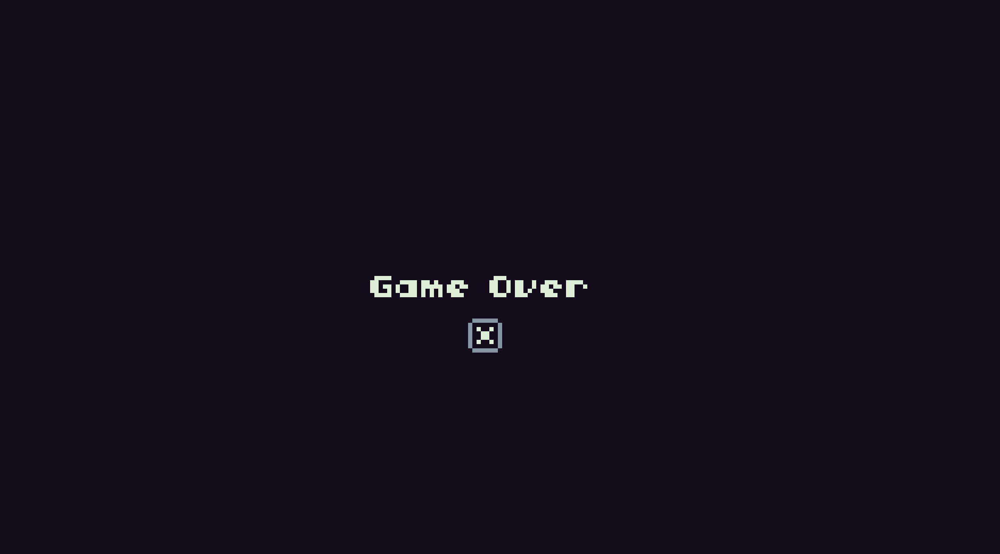
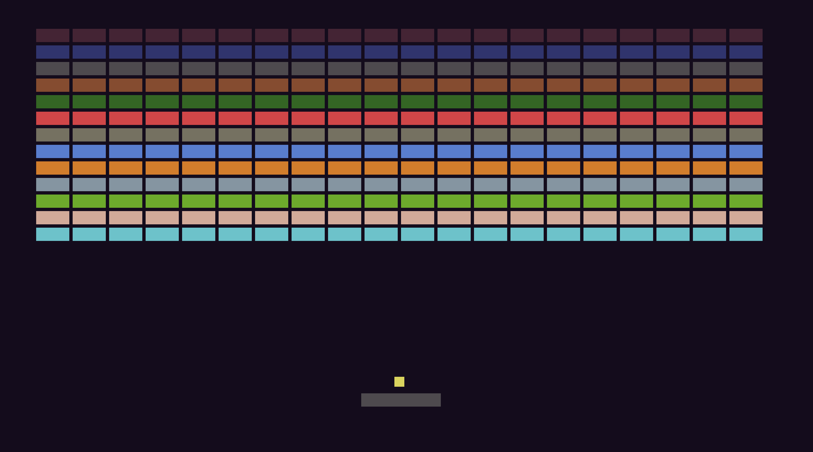

# Simple Breakout clone

In this short tutorial we are going to create a simple breakout clone.



We will start with the following basic structure:

```lua
-- title:  breakout clone
-- author: digitsensitive
-- desc:   a breakout clone in lua for TIC-80
-- script: lua

function init()
 -- here we initialize all our variables and game objects
end

init()

function TIC()
 -- here we will place our main game loop
 input()
 update()
 draw()
end

function input()
 -- so that the player can actually do something
end

function update()
 -- so that something is going on
end

function draw()
 -- so we can see something
end
```

This structure is general, and you can use it for every game. Be aware, that you have to call the init() function before the TIC() function.

## Our player
So let's start with the player. We first do the initialisation and decide that we need a player position (x,y) obviously, a size definition of how big our player will be (width, height), the color and the speed definition (only x, because the player can only move to left and right and the max speed).

> The x position is (240/2)-12, so that it is exactly centered

```lua
function init()
 -- our player
 player = {
  x = (240/2)-12,
  y = 120,
  width = 24,
  height = 4,
  color = 3,
  speed = {
   x = 0,
   max = 4
  }
 }
end

init()

function TIC()
 input()
 update()
 draw()
end
```

Now we finally want to see something on the screen, so let's skip the input() and update() functions for now and go directly to the draw() function. We will split it into two functions: One for the game objects and one for the GUI.

```lua
function draw()
 drawGameObjects()
 drawGUI()
end

function drawGameObjects()
end

function drawGUI()
end
```

Drawing the player is as simple as this:

```lua
function drawGameObjects()
 -- draw player
 rect(player.x,
  player.y,
  player.width,
  player.height,
  player.color)
end
```

If you run the game now you will see the following:


Well, we see the player BUT we also see the console commands. We need to
clear the screen! So let's do it in the TIC() function:

```lua
function init()
 -- variables
 bgColor = 0
end

function TIC()
 cls(bgColor)
 input()
 update()
 draw()
end
```

I have defined a variable in the init() function and access it in the cls()
function. So now it should look like this:


Great! Let's let's give the player some input now. We access the btn() function
to read the status of the buttons pressed. Check [API btn()](https://github.com/nesbox/TIC-80/wiki/btn)
for more informations. Here we only use the left and right arrow key to
move horizontaly to left and right. I have used local variables here with shorter
names for the player speed x and max speed.

```lua
function input()
 local sx = player.speed.x
 local smax = player.speed.max

 -- move to left
 if btn(2) then
  if sx>-smax then
   sx=sx-2
  else
   sx=-smax
  end	 
 end

 -- move to right
 if btn(3) then
  if sx<smax then
   sx=sx+2
  else
   sx=smax
  end
 end

 player.speed.x=sx
 player.speed.max=smax
end
```

Perfect. So we can change the speed now, but we will not see anything when
we do not update the position of the player. We do this in the update() function.
We also have to slow the player down, when he is not pressing any button.
We do this also in the update function.

```lua
function update()
 local px = player.x
 local psx = player.speed.x
 local smax = player.speed.max

 -- update player position
 px=px+psx

 -- reduce player speed
 if psx ~= 0 then
  if psx > 0 then
   psx=psx-1
  else
   psx=psx+1
  end
 end

 player.x=px
 player.speed.x=psx
 player.speed.max=smax
end
```

Fantastic! Now the player can move to the left and right ... but you surely
have noticed that you can move out of the screen! Let's fix that!

Since this is a collision, we will have a new function in the main TIC()
function called collisions()

```lua
function TIC()
 cls(bgColor)
 input()
 update()
 collisions()
 draw()
end
```

The collisions() function will handle all the game collisions. We will
separate each collision into their own function. So let's create the collision
check for player <-> screen now:


```lua
function collisions()
 -- player <-> wall collision
 playerWallCollision()
end

function playerWallCollision()
 if player.x < 0 then
  player.x = 0
 elseif player.x+player.width > 240 then
  player.x = 240 - player.width
 end
end
```

Ok - this is quite straight forward, since the screen width is 240 pixels.
Our player is for now done. Let's have a look at the ball.

## Our ball
We begin to set up the ball in the init function and think what kind of
parameters we will need for the ball. Like the player we need a position (x,y)
and a width, height and color. Similarly we have a speed definition, this time
not just in the x-axis but also the y-axis. This is clear, since the ball will
fly not just in the x-axis! We will use a boolean to see if the ball is active
or not (deactive). You will understand it in a bit.

```lua
function init()
 -- ball
 ball = {
  x = player.x+(player.width/2)-1.5,
  y = player.y-5,
  width = 3,
  height = 3,
  color = 14,
  deactive = true,
  speed = {
   x = 0,
   y = 0,
   max = 1.5
  }
 }
end
```

Now we have the ball object. We want that the ball starts on the player paddle.
If the player pressed the X-Key the ball will start to fly upward.
Let's update the input() function.

```lua
function input()
 if ball.deactive then
  ball.x = player.x+(player.width/2)-1.5
  ball.y = player.y-5

  if btn(5) then
   ball.speed.x = math.floor(math.random())*2-1
   ball.speed.y = -1.5
   ball.deactive = false
  end
 end
end
```

Next we have to update or update() function.

```lua
function update()
 -- update ball position
 ball.x = ball.x + ball.speed.x
 ball.y = ball.y + ball.speed.y

 -- check max ball speed
 if ball.speed.x > ball.speed.max then
   ball.speed.x = ball.speed.max
 end
end
```


Next we have to draw the ball, so we update our drawGameObjects() function.

```lua
function drawGameObjects()
 -- draw ball
 rect(ball.x,
  ball.y,
  ball.width,
  ball.height,
  ball.color)
end
```

Congratulation!

We can now start our ball from the paddle, but it won't
collide with the corners ... let's change this!

```lua
function collisions()
 -- ball <-> wall collision
 ballWallCollision()
end

function ballWallCollision()
 if ball.y < 0 then
  -- top
  ball.speed.y = -ball.speed.y
 elseif ball.x < 0 then
  -- left
  ball.speed.x = -ball.speed.x
 elseif ball.x > 240 - ball.width then
  -- right
  ball.speed.x = -ball.speed.x
 end
end
```

Great! So we have now the collision ball <-> walls activated! It is not
a mistake that I do not check the bottom collision in that function.
If the ball collides on the bottom of the screen, the player should loose a
life and the ball should reset to the starting position on the paddle.
Let's do it right here:

```lua
function collisions()
 -- ball <-> ground collision
 ballGroundCollision()
end

function ballGroundCollision()
 if ball.y > 136 - ball.width then
  -- reset ball
  ball.deactive = true
  -- loss a life
  if lives > 0 then
   lives = lives - 1
  elseif lives == 0 then
   -- game over
   gameOver()
  end
 end
end
```

When you run the game it will crash as soon as the ball hits the ground.
It is quite clear, why this happens. We have to define the lives variable
and the gameOver() function.

```lua
function init()
 -- variables
 lives = 3
end

function gameOver()
 print("Game Over",(240/2)-6*4.5,136/2)
 spr(0,240/2-4,136/2+10)
  if btn(5) then
   init()
  end
end
```

Alright. So we have our variable lives defined to 3. Every time the ball
hits the ground, one life will be subtracted. As soon as we have 0 lives,
we go into the gameOver() function and show the text "Game Over" and load
the sprite at position 0, which looks like this:



To restart the game, the player can press the X-Key.

So that everything works correct, we need to update the TIC() function
like this:

```lua
function TIC()
 cls(backgroundColor)
 input()
 if lives>0 then
  update()
  collisions()
  draw()
 elseif lives==0 then
  gameOver()
 end
end
```



Last but not least, let's do the collision check between ball and paddle:

```lua
function collisions()
 -- player <-> ball collision
 playerBallCollision()
end

function playerBallCollision()
 if collide(player,ball) then
  ball.speed.y = -ball.speed.y
  ball.speed.x = ball.speed.x + 0.3*player.speed.x
 end
end

function collide(a,b)
 -- get parameters from a and b
 local ax = a.x
 local ay = a.y
 local aw = a.width
 local ah = a.height
 local bx = b.x
 local by = b.y
 local bw = b.width
 local bh = b.height

 -- check collision
 if ax < bx+bw and
    ax+aw > bx and
    ay < by+bh and
    ah+ay > by then
     -- collision
     return true
 end
 -- no collision
 return false
end
```

## Our bricks
So we have a paddle and a ball, but it is not quite a game yet.
Let's create the central element of the game: The bricks.

As always we start with the initialisation.
```lua
function init()
 -- bricks
 bricks = {}
 brickCountWidth = 19
 brickCountHeight = 12

 -- create bricks
 for i=0, brickCountHeight, 1 do
  for j=0, brickCountWidth, 1 do
   local brick = {
    x = 10+j*11,
    y = 10+i*5,
    width = 10,
    height = 4,
    color = i+1
   }
   table.insert(bricks, brick)
  end
 end
end
```

We define an object table of bricks and the amount of bricks on the width
and heigth. Than we simply loop over it and create brick's, which we insert
into the bricks object. That's it.

Let's draw the bricks on the screen:

```lua
function drawGameObjects()
 -- draw bricks
 for i,brick in pairs(bricks) do
  rect(bricks[i].x,
       bricks[i].y,
       bricks[i].width,
       bricks[i].height,
       bricks[i].color)
 end
end
```

Well done. Your game should now look like this:



But ooh the ball flies through the bricks! Let's create the collision.

```lua
function collisions()
 -- ball <-> brick collision
 ballBrickCollision()
end

function ballBrickCollision()
 for i,brick in pairs(bricks) do
 -- get parameters
  local x = bricks[i].x
  local y = bricks[i].y
  local w = bricks[i].width
  local h = bricks[i].height

  -- check collision
  if collide(ball, bricks[i]) then
   -- collide left or right side
   if y < ball.y and
    ball.y < y+h and
    ball.x < x or
    x+w < ball.x then
    ball.speed.x = -ball.speed.x
   end
   -- collide top or bottom side		
   if ball.y < y or
    ball.y > y and
    x < ball.x and
    ball.x < x+w then
    ball.speed.y = -ball.speed.y
   end
   table.remove(bricks, i)
   score = score + 1
  end
 end
end
```

This might look a little bit complicated at first, but it isn't.
We loop through the bricks and get the important parameters at first.
We than check if there is any collision between the ball and the current brick
we loop through. If there is no collision we go to the next brick.
If there is a collision we check from which side: left/right or top/bottom.
This is important, since the ball will bounce differently. At the end we
remove the brick and add one point to the score.

Before you start the game, do not forget to add the score variable, else it
will crash:

```lua
function init()
 -- variables
 score = 0
end
```

Great!

## Our GUI
Cool, we quite have a game now! Let's finish it up with the GUI.

```lua
function drawGameObjects()
 print("Score ",5,1,7)
 print(score,40,1,7)
 print("Score ",5,0,15)
 print(score,40,0,15)
 print("Lives ",190,1,7)
 print(lives,225,1,7)
 print("Lives ",190,0,15)
 print(lives,225,0,15)
end
```

## The End
Thank you for reading through the tutorial. Feedback is very welcome!
Here the full code (4816 characters):

```lua
-- title:  breakout clone
-- author: digitsensitive
-- desc:   a breakout clone in lua for TIC-80
-- script: lua

function init()
	-- variables
	bgColor = 0
	score = 0
	lives = 3

 -- our player
 player = {
  x = (240/2)-12,
  y = 120,
  width = 24,
  height = 4,
  color = 3,
  speed = {
   x = 0,
   max = 4
  }
 }

	-- ball
 ball = {
  x = player.x+(player.width/2)-1.5,
  y = player.y-5,
  width = 3,
  height = 3,
  color = 14,
  deactive = true,
  speed = {
   x = 0,
   y = 0,
   max = 1.5
  }
 }

	-- bricks
 bricks = {}
 brickCountWidth = 19
 brickCountHeight = 12

 -- create bricks
 for i=0, brickCountHeight, 1 do
  for j=0, brickCountWidth, 1 do
   local brick = {
    x = 10+j*11,
    y = 10+i*5,
    width = 10,
    height = 4,
    color = i+1
   }
   table.insert(bricks, brick)
  end
 end
end

init()

function TIC()
 cls(backgroundColor)
 input()
 if lives>0 then
  update()
  collisions()
  draw()
 elseif lives==0 then
  gameOver()
 end
end

function input()
 local sx = player.speed.x
	local smax = player.speed.max

	-- move to left
	if btn(2) then
	 if sx>-smax then
		 sx=sx-2
		else
		 sx=-smax
		end	 
	end

	-- move to right
	if btn(3) then
	 if sx<smax then
		 sx=sx+2
		else
		 sx=smax
		end
	end

	player.speed.x=sx
	player.speed.max=smax

	if ball.deactive then
  ball.x = player.x+(player.width/2)-1.5
  ball.y = player.y-5

  if btn(5) then
   ball.speed.x = math.floor(math.random())*2-1
   ball.speed.y = -1.5
   ball.deactive = false
  end
 end
end

function update()
 local px = player.x
	local psx = player.speed.x
	local smax = player.speed.max

	-- update player position
	px=px+psx

	-- reduce player speed
	if psx ~= 0 then
		if psx > 0 then
		 psx=psx-1
		else
		 psx=psx+1
		end
	end

	player.x=px
	player.speed.x=psx
	player.speed.max=smax

	-- update ball position
	ball.x = ball.x + ball.speed.x
	ball.y = ball.y + ball.speed.y

	-- check max ball speed
	if ball.speed.x > ball.speed.max then
		ball.speed.x = ball.speed.max
	end
end

function collisions()
 -- player <-> wall collision
 playerWallCollision()

	-- ball <-> wall collision
 ballWallCollision()

	-- ball <-> ground collision
 ballGroundCollision()

	-- player <-> ball collision
 playerBallCollision()

	-- ball <-> brick collision
 ballBrickCollision()
end

function playerWallCollision()
 if player.x < 0 then
	 player.x = 0
	elseif player.x+player.width > 240 then
	 player.x = 240 - player.width
	end
end

function ballWallCollision()
 if ball.y < 0 then
  -- top
  ball.speed.y = -ball.speed.y    
 elseif ball.x < 0 then
  -- left
  ball.speed.x = -ball.speed.x
 elseif ball.x > 240 - ball.width then
  -- right
  ball.speed.x = -ball.speed.x
 end
end

function ballGroundCollision()
 if ball.y > 136 - ball.width then
  -- reset ball
  ball.deactive = true
  -- loss a life
  if lives > 0 then
   lives = lives - 1
  elseif lives == 0 then
   -- game over
   gameOver()
  end
 end
end

function playerBallCollision()
 if collide(player,ball) then
  ball.speed.y = -ball.speed.y
  ball.speed.x = ball.speed.x + 0.3*player.speed.x
 end
end

function collide(a,b)
 -- get parameters from a and b
 local ax = a.x
 local ay = a.y
 local aw = a.width
 local ah = a.height
 local bx = b.x
 local by = b.y
 local bw = b.width
 local bh = b.height

 -- check collision    
 if ax < bx+bw and
    ax+aw > bx and
    ay < by+bh and
    ah+ay > by then
     -- collision
     return true
 end
 -- no collision
 return false
end

function ballBrickCollision()
 for i,brick in pairs(bricks) do
 -- get parameters
  local x = bricks[i].x
  local y = bricks[i].y
  local w = bricks[i].width
  local h = bricks[i].height

  -- check collision
  if collide(ball, bricks[i]) then
   -- collide left or right side
   if y < ball.y and
    ball.y < y+h and
    ball.x < x or
    x+w < ball.x then
    ball.speed.x = -ball.speed.x
   end
   -- collide top or bottom side        
   if ball.y < y or
    ball.y > y and
    x < ball.x and
    ball.x < x+w then
    ball.speed.y = -ball.speed.y
   end
   table.remove(bricks, i)
   score = score + 1
  end
 end
end

function draw()
 drawGameObjects()
 drawGUI()
end

function drawGameObjects()
 -- draw player
 rect(player.x,
  player.y,
  player.width,
  player.height,
  player.color)

	-- draw ball
 rect(ball.x,
  ball.y,
  ball.width,
  ball.height,
  ball.color)

	-- draw bricks
 for i,brick in pairs(bricks) do
  rect(bricks[i].x,
       bricks[i].y,
       bricks[i].width,
       bricks[i].height,
       bricks[i].color)
 end
end

function drawGUI()
 print("Score ",5,1,7)
 print(score,40,1,7)
 print("Score ",5,0,15)
 print(score,40,0,15)
 print("Lives ",190,1,7)
 print(lives,225,1,7)
 print("Lives ",190,0,15)
 print(lives,225,0,15)
end

function gameOver()
 print("Game Over",(240/2)-6*4.5,136/2)
	spr(0,240/2-4,136/2+10)
	if btn(5) then
	 init()
	end
end
```
